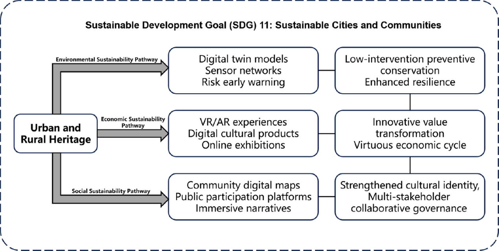
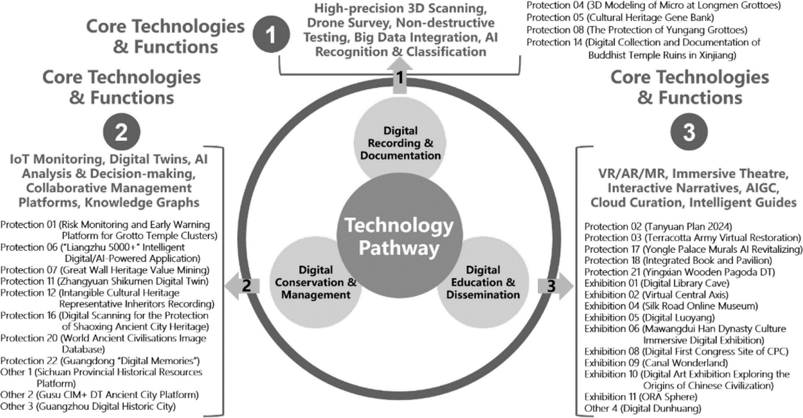

# Digital Applications in China’s Urban–Rural Heritage Conservation

**Chinese Title:** 中国城乡遗产保护中的数字化应用：技术发展、治理挑战与优化路径
**Date:** 2 June 2026
**Source:** FURP WeChat Official Account
**Section:** FURP Article Highlights
**Original WeChat Link:** https://mp.weixin.qq.com/s/JGGmBq1OD_VDypOTvHHSyg
**Full Article:** https://doi.org/10.1007/s44243-026-00079-4

## Keywords

Digital heritage; Urban–rural heritage conservation; Digital Twin; Heritage governance; Sustainable development

## Authors

Jianli Xiao & Zhicheng Bai

## Introduction

As digital technologies continue to advance, heritage conservation is undergoing a profound transformation from traditional restoration toward digitally enabled management. In recent years, China has implemented numerous digital heritage initiatives across historic districts, traditional villages, ancient buildings, grottoes, and intangible cultural heritage. Yet important questions remain: How do digital technologies reshape heritage conservation? What governance challenges accompany this transformation?
Drawing on 30 representative Chinese case studies, this paper systematically examines the application of digital technologies in heritage recording, information management, conservation decision-making, and public dissemination. The findings reveal a paradigm shift from static preservation toward dynamic sustainability. At the same time, challenges such as weak technical standardization, data silos, algorithmic bias, limited community participation, and threats to authenticity have become increasingly evident. The study proposes an integrated governance framework that balances technological rationality with humanistic values, offering valuable insights for the future digital transformation of urban–rural heritage conservation. 

## Key Arguments

1. Digital heritage is shifting conservation from static preservation to dynamic sustainability
   The paper identifies three stages in the evolution of digital heritage: Digital Documentation, Digital Interpretation, and Digital Reconstitution. Digital technologies have evolved from auxiliary tools into transformative forces reshaping heritage values, dissemination methods, and governance systems. 
2. Digital technologies are reshaping the entire lifecycle of heritage conservation
   Technologies such as Digital Twin, 3D laser scanning, HBIM, IoT monitoring, and AI analytics are enabling a shift from reactive restoration toward proactive monitoring and preventive conservation. Platforms such as the Liangzhu Digital Twin system and grotto monitoring systems now support real-time sensing, risk prediction, and intelligent early warning. 
3. Technological empowerment does not automatically lead to better governance
   The study identifies three major structural challenges:
   •	Incomplete technical standardization; 
   •	Data silos and weak interdepartmental coordination; 
   •	Formalized participation and persistent digital divides. 
   These findings suggest that digitalization is not merely a technological issue but fundamentally a governance challenge.
4. China is developing a state-led polycentric governance model
   The authors argue that China is gradually moving from purely government-led heritage management toward a collaborative model involving governments, enterprises, research institutions, and communities. This “state-led polycentric governance” model offers a distinctive Chinese approach to heritage conservation under rapid urbanization. 

## Conclusion
The study demonstrates that digital technologies are fundamentally reshaping the concepts, methods, and governance of urban–rural heritage conservation. Technologies such as digital documentation, Digital Twins, AI, and immersive experiences enhance conservation efficiency while creating new opportunities for heritage revitalization and public engagement. However, technological advancement does not automatically result in governance improvement. Future digital heritage development must balance innovation with cultural values and move from technology-driven approaches toward governance-driven transformation. 

## Future Research Directions
1. Develop digital standards tailored to China's diverse heritage contexts.
2. Establish interoperable data-sharing mechanisms across agencies and regions.
3. Improve cultural sensitivity and fairness in AI-driven heritage applications.
4. Promote community co-creation and strengthen local narrative sovereignty.
5. Develop evaluation frameworks for measuring digital heritage governance effectiveness. 

## Images

---

[Back to FURP Article Highlights](../../sections/furp-article-highlights.html)
[Back to Homepage](../../)
